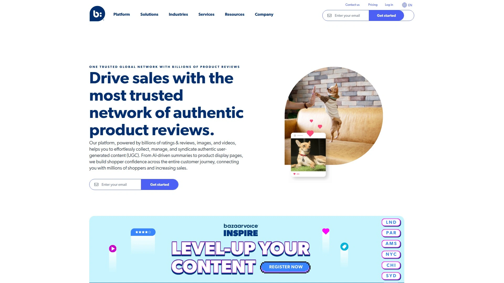
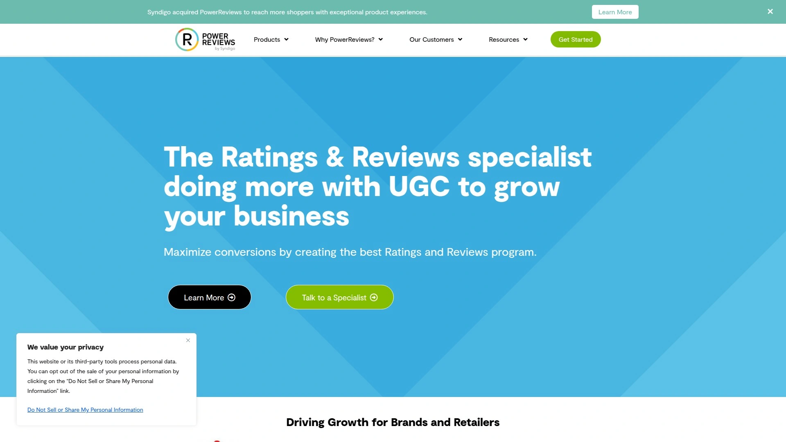

# 2025: 12 Top-Tier Customer Review Collection Platforms You Must Know

Online shoppers read an average of seven reviews before deciding to buy, but getting customers to leave those reviews feels like pulling teeth—especially photo and video testimonials that actually drive conversions. Review collection platforms automate post-purchase follow-ups, incentivize visual submissions with discounts, and display that user-generated content beautifully across your site without touching a single line of code. From simple star ratings to shoppable Instagram galleries, these tools transform satisfied customers into your most effective marketing team while building the trust signals that Google rewards with higher search rankings.

## **[Fera](https://fera.ai)**

Photo and video review collection specialist automating everything from request emails to widget customization, rated 4.9/5 by thousands of merchants.

Fera focuses heavily on visual reviews—photo and video submissions that convert better than text alone. The platform automatically requests reviews after order fulfillment with dynamically customizable timing, sends follow-up reminders to non-responders, and can incentivize submissions with discount codes generated upon approval. Review request emails use frictionless in-mail technology allowing customers to upload media directly from any device without leaving their inbox.

Display options include over 45 widgets covering review lists, rating badges, media galleries, and testimonial sliders that work immediately without coding. Shopify Theme 2.0 users add widgets directly from their theme editor, while other platforms use simple embed codes. The platform verifies reviews with "Real Shopper" badges and moderates submissions before publication, giving you complete control over displayed content.

Multi-source review aggregation syncs verified reviews from Google, Facebook, Etsy, AliExpress, and other platforms, combining them with self-collected reviews in unified displays. This creates comprehensive social proof even for new stores with limited direct reviews. SEO features automatically add rich snippets showing star ratings in Google Search and Shopping results, increasing click-through rates from search pages.

Pricing starts free with basic features, $9/month for Startup (100 review requests, 2 users, 100MB storage), and $29/month for Growth (1,000 requests, unlimited users, 1GB storage). Integration capabilities span Klaviyo, Gorgias, PageFly, Smile.io, PushOwl, and 45+ other apps. Customer support receives consistent praise for responsiveness and technical problem-solving.

## **[Judge.me](https://judge.me)**

Unlimited free reviews with photo/video support, 24/7 support averaging 40-second response times, and the most-reviewed app in Shopify's ecosystem.

Judge.me operates on an genuinely generous freemium model—unlimited product and store reviews, photo/video submissions, review requests, customizable widgets, and Google Shopping integration all included free forever. The $15/month Awesome plan adds features like review carousels, advanced customization, coupon incentives, Q&A functionality, and priority support, but most small businesses thrive on the free version indefinitely.

Setup takes under five minutes through automated installation that places review widgets and star ratings on product pages instantly. Automatic review request emails send after purchase with customizable timing and templates, while smart reminders follow up with non-responders. The platform supports unlimited reviewer photos and videos even on free plans—a rarity among competitors charging premium prices for visual review capabilities.

Import capabilities bring in existing reviews from Yotpo, Loox, Shopify Product Reviews, Amazon, Etsy, and other platforms with automated migration tools. Reviews sync across product variants and can be shared between similar products through product groups. The review display includes filtering by star rating, search functionality, helpful voting, and sortable topics.

Customer support distinguishes Judge.me—live chat responses average 40 seconds with 24/7 availability from actual humans rather than chatbots. Over 31,000 Shopify reviews give Judge.me a 5.0 rating, making it the most-reviewed app in the entire Shopify ecosystem. Integration partners include Klaviyo, Gorgias, LoyaltyLion, AfterShip, PushOwl, and PageFly.

## **[Loox](https://loox.app)**

Visual review specialist with built-in referrals, upsells, and smart discounts, used by 130,000+ brands prioritizing photo/video social proof.

Loox concentrates exclusively on visual reviews—photos and videos that create stronger social proof than text reviews. The platform optimizes every collection step with smartly timed requests and proven incentives, maximizing visual submission rates well above industry averages. Automated review requests include customizable discount offers for photo/video submissions, with single-use Shopify discount codes preventing abuse.

Widget varieties span carousels, pop-ups, sidebars, grids, and product page embeds that blend with any theme without coding. The homepage to checkout journey features review displays at strategic conversion points—not just product pages. Visual reviews automatically become shoppable, letting customers click photos to visit featured products directly.

Built-in conversion tools extend beyond basic reviews: referral programs turn happy customers into advocates earning rewards for bringing friends, post-purchase upsells offer complementary products during thank-you page visits, and smart discounts reward reviewers with future purchase incentives. Review syndication pushes your content to Google Shopping, Facebook, TikTok, and other channels where customers discover products.

Pricing starts with 14-day free trials, then monthly plans based on order volume. The platform works seamlessly with any Shopify theme, BigCommerce site, or page builder through zero-code implementation. Customer support consistently receives praise for fast response times and proactive customization assistance—representatives often fix issues within minutes while users wait on chat.

## **[Yotpo](https://www.yotpo.com)**

Enterprise-grade ecommerce marketing platform combining reviews, loyalty programs, SMS marketing, and subscriptions under unified analytics.

Yotpo positions itself as a comprehensive retention marketing solution rather than just a review tool. The Reviews module collects ratings, photos, videos, and Q&A submissions through post-purchase emails and SMS requests, with AI-driven timing optimization improving response rates. Visual content moderation uses automated filtering plus manual approval workflows, while watermarking protects branded imagery.

Display customization reaches advanced levels—conditional logic shows specific reviews to customer segments, A/B testing compares widget performances, and dynamic displays highlight reviews matching shopper demographics or purchase patterns. The platform's standout feature is review syndication across retail and social networks including Google Shopping, Facebook, TikTok Shop, Instagram, Amazon, and major retailers like Walmart and Target.

Loyalty and Rewards integration creates cohesive customer experiences where review submissions earn points redeemable for discounts, early access, or VIP status. SMS marketing sends review requests via text with higher open rates than email, while subscription management ties into the broader retention strategy. Analytics track not just review metrics but their impact on conversion rates, average order values, and customer lifetime value.

Pricing operates at enterprise levels—implementations typically start around $200+/month depending on order volume and features activated. The platform acquired SMSBump for SMS capabilities and continues expanding through acquisitions, making it a continuously evolving ecosystem. Technical integration requires more setup time than simpler alternatives, with some merchants reporting months-long onboarding periods.

## **[Stamped.io](https://stamped.io)**

Combined reviews and loyalty platform at mid-tier pricing, featuring checkout reviews, NPS surveys, and Bazaarvoice syndication to Walmart/Target.

Stamped.io bundles product reviews with loyalty program functionality in a single subscription. Review collection spans standard post-purchase emails plus unique checkout review requests that capture feedback immediately after order completion while excitement remains high. The platform also collects Net Promoter Score (NPS) surveys measuring overall brand sentiment alongside product-specific ratings.

Visual UGC capabilities include in-email photo/video upload technology, Instagram shoppable galleries with automated rights management, and computer vision moderation that flags inappropriate content automatically. Stamped IQ uses AI to identify dominant colors, objects, and quality levels in submitted images, helping curate the best visuals for display. Album organization groups related images into collections showcased on dedicated pages.

Bazaarvoice integration syndicates collected reviews to Walmart, Target, and other major retailers in the Bazaarvoice Network—a feature typically reserved for enterprise platforms. Google Shopping Reviews display ratings on Product Listing Ads, while rich snippets show star ratings in organic search results. Multi-language support includes English, French, German, Spanish, Portuguese, and Italian.

Pricing starts at $23/month for basic reviews, with higher tiers adding loyalty features, SMS review requests, advanced analytics, and dedicated account management. The combined reviews-plus-loyalty approach costs significantly less than subscribing to separate services for each function. Merchants frequently cite Stamped as a more affordable alternative to Yotpo with comparable functionality.

## **[Trustpilot](https://www.trustpilot.com)**

Global review platform with 300+ million reviews across 1.27 million domains, emphasizing company reputation over individual product reviews.

Trustpilot operates as a public review site first, business tool second—consumers visit Trustpilot directly to research companies before purchasing, similar to Yelp or Google Reviews. Unlike product-focused platforms, Trustpilot emphasizes store-level and service reviews that reflect overall brand experience. This public nature means reviews appear on Trustpilot's website regardless of whether businesses claim their profiles or subscribe to services.

Business subscriptions provide tools to automate review collection, respond to feedback, display TrustBox widgets on your site, and analyze sentiment trends. Automated review invitations send after purchases through ecommerce integrations, while customizable TrustBox displays show real-time review counts, star averages, and recent testimonials on homepages, product pages, and checkout flows.

Google Seller Ratings integration through licensing agreements displays Trustpilot scores as star ratings below Google Ads and Shopping listings, significantly improving click-through rates from paid search. Over 61 million new reviews were written on Trustpilot in 2024, with 71% of surveyed US consumers agreeing that good Trustpilot scores make them more likely to purchase.

Criticism centers on fake review vulnerabilities and the platform's freemium model that some perceive as favoring paying businesses over consumers. Trustpilot claims to remove millions of fake reviews annually through automated fraud detection and manual moderation, though controversies periodically surface. Pricing operates on quoted enterprise models rather than transparent monthly rates, with packages varying based on business size and features needed.

## **[Bazaarvoice](https://www.bazaarvoice.com)**

Enterprise ratings and reviews platform specializing in retail syndication networks, serving Fortune 500 brands and major retailers.

Bazaarvoice targets large brands and retailers needing sophisticated UGC collection, distribution, and analytics across complex multi-channel operations. The platform's defining feature is its syndication network—brands distribute collected reviews to hundreds of retail partners, while retailers receive reviews from thousands of brands, creating comprehensive product coverage across the ecommerce ecosystem.

Review collection methods include email, SMS, in-product feedback prompts, and social media monitoring. The Multi-Product Submission feature lets customers review multiple purchases in a single form, increasing review volume up to 8x compared to single-product requests. In-Mail technology enables photo/video upload directly within email interfaces, removing friction from visual submission processes.

Connections functionality allows brands to respond to reviews and questions across both their own sites and retail partner sites from a unified dashboard. This capability proves critical for brands selling through multiple retailers who need centralized reputation management. Advanced targeting shows relevant reviews to specific customer segments, while fraud detection systems identify and filter suspicious submissions.

Pricing operates exclusively at enterprise levels with quoted implementations rather than published rates. Merchants consistently report Bazaarvoice as the most expensive option in the review platform market, suitable only for established brands with significant budgets. Technical implementation requires developer resources for full API integration and customization. Customer feedback highlights slow support response times and complex troubleshooting processes.

## **[Rivyo](https://rivyo.com)**

Budget-friendly Shopify review app with lifetime free plan, product Q&A, and review imports from Amazon/AliExpress for dropshippers.

*Based on research indicating Rivyo as a popular Shopify review platform for budget-conscious merchants and dropshipping businesses.*

Rivyo targets dropshippers and new store owners through permanently free plans with no trial expiration dates. The platform handles standard review collection via automated post-purchase emails with customizable templates and timing delays. Star rating widgets display on product and collection pages, while full review lists embed on product pages without coding.

Amazon and AliExpress review import capabilities help dropshippers populate new stores with social proof before generating their own reviews. Bulk import tools bring over ratings, text reviews, reviewer names, and dates from supplier product pages. Product Q&A sections let potential customers ask questions answered by store owners or previous buyers, addressing concerns before purchase.

Photo review support includes customer-uploaded images displayed in grid galleries or carousels. Review moderation queues let store owners approve or decline submissions before publication. Basic customization options adjust widget colors, fonts, and layouts to match store themes. Integration with Google Shopping adds star ratings to product listings in search results.

Paid plans unlock features like video reviews, advanced widget designs, review request reminders, coupon incentive codes, and priority email support. Pricing remains significantly lower than enterprise platforms—typically under $10/month for small stores. The platform focuses on simplicity and quick setup rather than advanced analytics or enterprise integrations.

## **[Okendo](https://okendo.io)**

Customer marketing platform combining reviews, referrals, quizzes, and surveys with deep segmentation and personalization capabilities.

*Based on industry knowledge of Okendo as a comprehensive customer marketing solution focused on owned audience engagement.*

Okendo extends beyond basic review collection into broader customer marketing territory. The platform combines product reviews with customer referral programs, purchase-driven surveys, interactive quizzes for product recommendations, and detailed customer segmentation. This holistic approach treats reviews as one component of ongoing customer relationship management rather than an isolated social proof tactic.

Attribution tracking connects review content directly to revenue—showing which reviews drove specific purchases, calculating ROI from review programs, and identifying highest-performing review types. Personalization engines display reviews to shoppers based on their browsing behavior, demographics, purchase history, and quiz responses. Dynamic review displays show different content to first-time visitors versus returning customers or VIP segments.

Attributes collection gathers structured feedback beyond star ratings—fit information for apparel, skin type for cosmetics, difficulty levels for DIY products, or any custom attributes relevant to specific industries. Shoppers filter reviews by these attributes to find feedback from similar customers. Surveys triggered by purchase events or customer journey milestones collect NPS scores, satisfaction ratings, and open-ended feedback.

The platform emphasizes owned audience building—capturing zero-party data through quizzes, surveys, and review incentives that brands control directly rather than relying on third-party platforms. Pricing typically starts around mid-tier enterprise levels with custom quotes based on order volume. Implementation requires more onboarding time than plug-and-play alternatives due to advanced features.

## **[PowerReviews](https://www.powerreviews.com)**

Enterprise review platform with retail syndication, sampling programs, and influencer partnerships for product launches.

*Based on industry knowledge of PowerReviews as an established enterprise review solution competing with Bazaarvoice.*

PowerReviews serves mid-market to enterprise brands and retailers with sophisticated review collection and distribution needs. The platform's retail network syndicates reviews across partner retailers similar to Bazaarvoice, helping brands build consistent product reputation across multiple sales channels. Brands control which retail partners receive their reviews while retailers access reviews from participating brands.

Sampling programs accelerate review collection for new product launches by sending free samples to targeted customers in exchange for honest reviews. These seeding campaigns generate initial social proof before products hit retail shelves. Influencer integration coordinates with content creators who receive products for review, streamlining the relationship management and content collection process.

Review moderation balances automation with human oversight—AI flags potentially fake or inappropriate submissions while trained moderators make final decisions. Negative review management tools alert brands to complaints requiring immediate attention and facilitate response workflows. Question-and-answer capabilities let shoppers ask product questions answered by brands or previous purchasers.

Analytics dashboards track review velocity, sentiment trends, attribute mentions, and competitive benchmarking against similar products. Syndication reporting shows which retail partners drive the most engagement from shared reviews. Custom reporting exports data for integration with business intelligence platforms. Pricing operates on enterprise quotes rather than transparent monthly rates, typically requiring annual contracts.

## **[Reviews.io](https://reviews.io)**

UK-based review platform with product and company reviews, video testimonials, and social media integration at competitive mid-market pricing.

*Based on research indicating Reviews.io as a UK-focused review platform compared with other services.*

Reviews.io provides both product-level and company-level review collection through a unified platform. The dual approach captures granular product feedback while also building overall brand reputation scores. Video review collection features prominently with in-email recording capabilities and showcase widgets designed specifically for video testimonials.

Social proof widgets include floating badges, carousels, grids, and pop-ups that display recent reviews and star ratings across site pages. Third-party review integration pulls feedback from Google, Facebook, and industry-specific platforms, consolidating reputation management in one dashboard. Real-time notification pop-ups show recent purchases and reviews to create urgency and social validation for current visitors.

Seller and product badges provide portable trust signals—embeddable graphics showing review counts and star averages that brands use in email campaigns, social media posts, and marketplace listings. Rich snippets automatically implement schema markup for Google search result star displays. Multi-language support and international review collection serve global brands operating across multiple markets.

Pricing starts around mid-tier levels (approximately $45+/month) positioning Reviews.io between budget Shopify apps and true enterprise platforms. Customer feedback sometimes cites the platform as more expensive than alternatives with similar features. Setup and widget customization receive mixed reviews regarding user-friendliness compared to more streamlined competitors.

## **[Shopper Approved](https://www.shopperapproved.com)**

Google-certified review platform specializing in verified purchase reviews, video testimonials, and seller rating integrations with shopping ads.

*Based on industry knowledge of Shopper Approved as a Google Partner focused on verified review collection and ad integrations.*

Shopper Approved emphasizes verified purchase reviews through direct integrations with ecommerce platforms that confirm reviewer identity and transaction completion. This verification provides stronger authenticity signals than anonymous or unverified submissions. Google Partner certification enables direct integration with Google Customer Reviews and Google Seller Ratings programs affecting paid search performance.

Video testimonial collection includes desktop and mobile recording interfaces, automated transcription services, and moderation workflows. Brands showcase video reviews through dedicated gallery pages, product page embeds, or social media sharing. Video content typically generates higher engagement and conversion impact than text-only reviews.

The platform collects both seller ratings (overall company experience) and product reviews (specific item feedback) in parallel programs. Seller ratings feed into Google Seller Ratings appearing below Google Ads, while product reviews display on individual product pages and in Google Shopping results. This dual approach builds comprehensive brand reputation across channels.

Integration partnerships include major ecommerce platforms, email marketing services, and CRM systems. Custom API access allows technical teams to build specialized workflows. Analytics track review collection rates, reviewer demographics, sentiment analysis, and correlation with sales performance. Pricing typically falls in the mid-market range with packages based on order volume and feature selection.

## **Do visual reviews (photos/videos) actually increase sales compared to text reviews?**

Multiple studies show products with visual reviews convert 5-10% higher than text-only reviews. Photos prove products match marketing claims—colors, sizing, quality—while videos demonstrate usage in real environments. The authenticity factor matters most: 79% of shoppers say user-generated photos influence purchase decisions more than professional product photography. Platforms prioritizing visual review collection (offering incentives, making upload frictionless) see 30-40% of reviews include images compared to 5-10% without optimization. For fashion, home goods, and beauty categories, visual proof becomes especially critical since customers need to visualize products in use.

## **Should I use a dedicated review platform or my ecommerce platform's native reviews?**

Native reviews (like Shopify Product Reviews) work for basic needs but lack automation, visual submissions, multi-source aggregation, and advanced displays that dedicated platforms provide. If you're collecting under 10 reviews monthly and don't need photos/videos, native tools suffice. Beyond that threshold, dedicated platforms automate the entire workflow—request sending, reminder follow-ups, incentive management, moderation—saving hours weekly. The SEO benefits from rich snippets, Google Shopping integration, and review syndication typically generate ROI within 2-3 months through improved search visibility alone. Budget-conscious stores can start with generous free tiers from Judge.me or Fera before graduating to paid plans.

## **How do I handle negative reviews without removing them?**

Responding professionally to negative reviews converts 33% of detractors into promoters according to research. Acknowledge the specific issue, apologize for their experience, explain what went wrong, and describe how you've fixed or will fix the problem. Offer direct contact for resolution—email, phone, chat—to move conversations offline. Prompt responses (within 24-48 hours) show future customers you care about satisfaction. Most platforms let you flag reviews as "helpful response provided" or similar tags that surface your reply prominently. Over time, a pattern of professional negative review responses builds more trust than perfect 5-star ratings that look suspicious.

## Conclusion

Review collection platforms eliminate the manual grind of chasing customer feedback while transforming satisfied buyers into your most credible marketing channel. **[Fera](https://fera.ai)** stands out particularly for growing ecommerce brands prioritizing visual social proof—the platform's strength in photo and video review automation, combined with multi-source aggregation from Google/Facebook/Etsy, means you're building comprehensive trust signals even if your store launched yesterday. Whether you start on the free tier or jump into the $9/month Startup plan, the automated review request workflows with in-email media upload and customizable incentives create steady review flow without ongoing manual effort, while the 45+ widget options and verified buyer badges address the specific trust gap that causes 70% of potential customers to abandon carts without purchasing.
